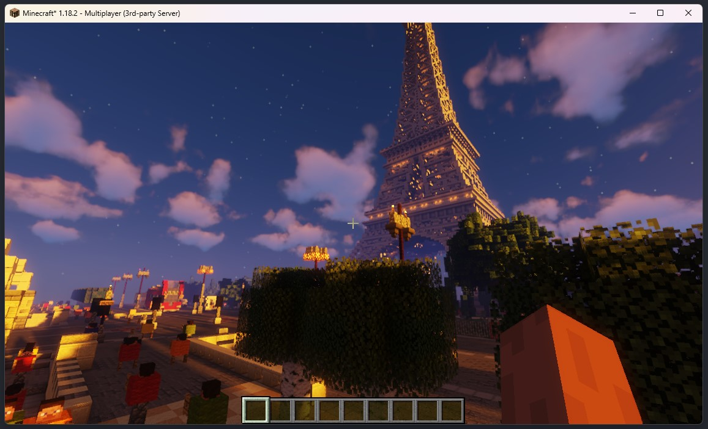

In this workshop, you will learn how to build a Terraform provider using the 
new `Terraform Plugin Framework`. 

You are going to build a plugin that allows you to Terraform a Minecraft
world. Through writing Terraform you will be able to place blocks and 
complex objects.

Your current environment provides all the software you need to complete 
this workshop. Before continuing, let's explore this.

### API Documentation

The API for the Minecraft server is running at:

[http://minecraft.container.shipyard.run:9090](http://minecraft.container.shipyard.run:9090)

You will use this when interacting with your Terraform provider through the
provided go client SDK.

Documentation for this API can be seen by viewing the `ReDoc` documentation at
the following location:

[http://minecraft.container.shipyard.run:9090/redoc](http://minecraft.container.shipyard.run:9090/redoc)


### Minecraft

There is also a Minecraft server running that is unique to your environment; there 
is no need to worry about doing something that impacts the other
participants.

You can connect to the server in one of two ways, either using the built
in browser based viewer or your own Minecraft client.

#### Connecting to the Server - Minecraft Client
To connect using your own Minecraft client, you can use the following settings
when adding a new server in the multiplayer options. 

```
Server: minecraft.container.shipyard.run
Port: 25565
```


The city you will be terraforming should look familiar to you.



:::note
Only the Java version of Minecraft will work.
:::

#### Connecting to the Server - Minecraft Browser

If you do not have a Minecraft client, then you can use the browser based
client. To access this open the following URL in your browser:

[http://minecraft.container.shipyard.run:8080](http://minecraft.container.shipyard.run:8080)


Click play and when requested you can use the following details to connect:

```
Server: minecraft.container.shipyard.run
Port: 25565
```


While this does not look anywhere as nice as the official Minecraft client, 
it is a) free and b) Minecraft in the browser.

Looks aside, the browser-based client will provide all the functionality 
you need for this workshop.

That is all you need to know about the setup; let's start building our provider.

<VSCodeTerminal command="ls -las" target="Terminal 1">
  <Command>go run main.go</Command>
</VSCodeTerminal>

```shell
go run main.go
```

Change something here
